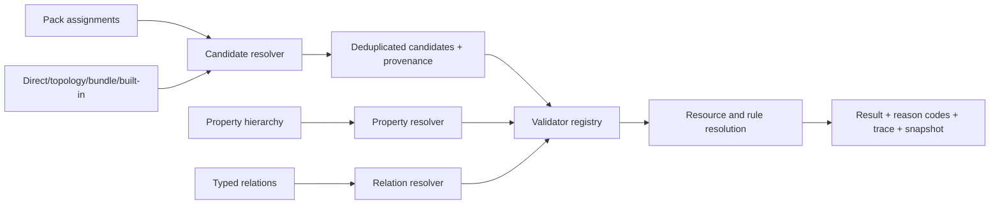

# ADR-011 — Universal Compatibility Engine

Status: accepted in stage 04.

## Decision

`serverConfigurator` owns one deterministic, side-effect-free Compatibility Engine. Store options, validation, pricing, cart validation and Admin readiness consume its contracts; clients do not reproduce compatibility or effective-value calculations.

The engine never evaluates JavaScript or arbitrary expressions from Admin/import data. A `ComponentTypeDefinition.validator_key` selects a function from the closed registry: CPU, memory, storage, RAID/HBA, expansion, network, accelerator, boot storage, power or cooling. An unknown key is a publication blocker.

## Deterministic phases

1. Resolve properties broad-to-narrow: global → platform → generation → family → model → chassis/storage option. Equal-priority contradictory values produce `PROPERTY_PRIORITY_CONFLICT`; no value is silently selected as authoritative.
2. Resolve candidates from pack, direct, topology, assembly bundle, auto-added and built-in sources. A component is emitted once with `source_types[]` and source IDs.
3. Normalize duplicate selected IDs by merging quantities while reporting `DUPLICATE_COMPONENT_ID`; reject non-positive/non-integer quantities.
4. Build facts from every selected instance, not only the first component of a type.
5. Run registered calculators, bay placement, generic provided/consumed resources and engine-mapped typed relations.
6. Apply rules in stable priority/ID order through whitelisted operators and actions.
7. Return deterministic results separately from repair recommendations.

Pack membership and generation assignment are candidate provenance only. Every candidate still passes schema, topology, resource, qualification, relation and exception checks.

## Storage and expansion

Storage consumes concrete zone capacity. For each drive instance the engine checks requested zone, native/accepted form factor, approved adapter, protocol and per-protocol capacity, then records `zone_id`, `bay_id` and a placement reason. The same topology supports mixed drives, optional rear/internal zones and partial NVMe capacity. Controller maximums and required cables are independent constraints.

Expansion aggregates PCIe slots/lanes across RAID, NIC, riser, accelerator and PCIe boot storage. Network slot data remains normalized (`pcie_expansion` or `network_mezzanine`) while exact FlexibleLOM/NDC/OCP labels remain data. Accelerator checks qualification, quantity, dimensions, power cable, fan kit and riser. Boot storage supports M.2/vendor controllers and RAID1 pair semantics.

## Rules contract

Allowed condition operators are `equals`, `not_equals`, numeric comparisons, `includes`, `not_includes`, `in`, `not_in`, `exists` and `not_exists`, composed with `and`, `or` and `not`. Allowed action fields are warning, component target, limit, effective value and additive/multiplicative price changes. Unknown operators/actions block with trace; they are never ignored or executed.

Scopes are global, brand, generation, family, server model, chassis variant and selected component. Model and component guards run before rules. `require` is verified after resolution; `auto_add` is recorded in the technical snapshot.

## API contracts

`GET /store/server-configurator/models/:slug/options` returns `source_type/source_types`, `available/disabled`, reason codes/message, max quantity, effective specs, required bundles, conflicts, qualification and triggered rules. It also returns drive suggestions with `compatible`, `compatible_with_adapter`, `technically_compatible` or `incompatible`.

`POST /store/server-configurator/validate` and `/price` accept validated model identity, selected components, optional storage option, explicit-none groups and a validation mode. Production/cart decisions are server-authoritative.

`POST /admin/server-configurator/compatibility-readiness` is authenticated by the Medusa `/admin/*` boundary and performs no writes. It supports:

- `guided_check`: first next blocker plus repair choices;
- `assisted_preview`: all deterministic findings plus separate proposed mappings/predicted effects;
- `bulk_dry_run`: manifest identities, dependency existence/cycles and idempotency;
- `production_validation`: unresolved compatibility data is blocking.

Partial drafts return `unresolved` and never `compatible`. Recommendations are machine-readable but never applied by the engine.

## Backward compatibility and safety

Legacy `specs_json` is read first and canonical `normalized_specs_json` overrides mapped values. Models without canonical assignments use a clearly traced `built_in/legacy-applicability` candidate bridge; any canonical source disables that fallback. No schema migration, backfill or destructive data operation is required by this stage.

The service loads registry/domain datasets in one parallel batch after model lookup; evaluation is pure and has no per-option database query. Candidate resolution is shared across option previews to avoid quadratic re-resolution.

