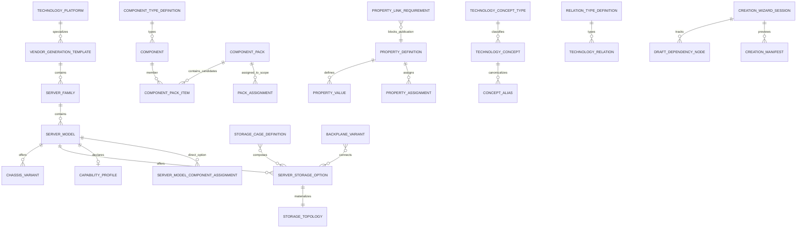

# ADR-010 — Canonical server domain model

Status: accepted in stage 03.

## Decision

The `serverConfigurator` Medusa module owns one data-driven server domain. `PropertyDefinition` is the canonical registry; `AttributeDefinition` remains a contract alias only and no parallel attribute table exists. Candidate packs provide choices but never prove compatibility. Stage 04 is the only owner of runtime compatibility decisions.

Raw source facts, normalized facts, requirements, provisions, consumption, applicability and provenance are separate fields. Legacy `Component.specs_json` remains readable and is copied, never moved or deleted.

## Entity and relationship diagram



Polymorphic owner/scope relations (`owner_type + owner_id`, `scope_type + scope_id`) intentionally avoid coupling the module to vendor-specific tables. Concrete internal references have indexed foreign keys; constraints are initially `NOT VALID` so unknown legacy orphans cannot abort an additive rollout. New writes are still enforced. A later verified cleanup may validate these constraints.

## Ubiquitous language and invariants

- `ComponentTypeDefinition`: extensible equipment class plus JSON/UI schema, fact mapping, explicit validated/informational mode and validator contract. Initial keys include CPU, RAM, drive, RAID, NIC, PSU, riser, backplane, drive cage, boot storage, accelerator, cooling, cable, rails, license and service. Accelerator subtype is GPU, FPGA, DPU or AI accelerator.
- `PropertyDefinition`: the one property registry for platforms, generations, families, models, chassis, storage options, components, packs, bundles and configurations.
- `TechnologyConcept`: canonical vendor-neutral or vendor-specific concept; aliases never create a second concept.
- `TechnologyRelation`: typed and sourced relation between entities/concepts.
- `ComponentPack`: candidate pool, assembly bundle or platform template. Membership is not compatibility.
- `PackAssignment`: scoped candidate source with inheritance, override or explicit exclusion and provenance. A `scope_type=server_model` record is the `ServerModelPackAssignment` contract.
- `ServerModelComponentAssignment`: rare direct component option. It still requires a registered component type and later engine validation.
- `CapabilityProfile`: versioned platform/CPU/memory/storage/expansion/network/accelerator/boot-storage/power/cooling/management sections.
- `StorageTopology`: final physical zones and constraints, never a pack.
- `ConfiguratorOptionGroup.allow_none`: real selection state. “None” is not a Component or fake SKU.

Compatibility properties without both a fact path and validator key have the blocking effective status `unmapped_compatibility_property`.

## Entity decision table

| Situation | Canonical entity |
|---|---|
| Same alternatives serve many scopes | `ComponentPack` + `PackAssignment` |
| One model-specific part | `ServerModelComponentAssignment` |
| Parts always installed together | `ComponentPack(pack_kind=assembly_bundle)` |
| Part changes physical bays/slots/zones | `StorageTopology` or enablement bundle |
| Rare logical exception | `CompatibilityRule` |
| Descriptive-only characteristic | informational `PropertyDefinition` |

A one-item pack is not created only to make a component visible.

## Inheritance contract

```text
global
→ TechnologyPlatform
→ VendorGenerationTemplate
→ ServerFamily
→ ServerModel
→ ChassisVariant / ServerStorageOption
```

Resolution walks from broad to narrow. `override` replaces the inherited assignment/value, `exclude` removes it explicitly, and every resolved record returns its originating scope. Shared CPU/RAM packs belong on `TechnologyPlatform`; vendor RAID/riser/rails/management defaults belong on `VendorGenerationTemplate`; drive packs are assigned or suggested for a `ServerStorageOption`.

## Storage contract

`StorageCageDefinition.bay_groups_json` keeps location, count, native form factor, accepted form factors, adapter requirements, hot-swap, numbering and per-zone protocol limits. `BackplaneVariant` keeps protocols, connectors, direct/expander mode, lane/controller/cable requirements and provides/consumes/conflicts. A `ServerStorageOption` binds concrete cage/backplane variants; equal bay counts with different backplanes are different options.

Drive-pack suggestions require all of form factor, protocol, approved adapter (when required), controller capabilities, bay availability and qualification scope. They are explained suggestions only; stage 04 performs final compatibility.

## Legacy-to-canonical mapping

| Legacy source | Canonical target | Stage-03 behavior |
|---|---|---|
| `Component.specs_json` | `normalized_specs_json` | copied verbatim as a lossless partially-normalized adapter value |
| `Component.specs_json` | `raw_specs_json` | copied verbatim for source preservation |
| embedded `source_doc_reference` | `source_json` | wrapped with adapter provenance |
| component `type` enum | `ComponentTypeDefinition.key` | legacy type retained; registry bootstrapped |
| pack brand/family/generation/chassis arrays | `PackAssignment` | legacy arrays retained for API compatibility; new inheritance uses assignments |
| server scalar capability columns | `CapabilityProfile` / properties / concepts | scalars retained until source-backed mapping is reviewed |
| CPU `socket` strings | `TechnologyConcept(cpu_socket)` | FCLGA3647/LGA3647/Socket P aliases converge on one concept; legacy text retained |

Known legacy keys such as `cores`, `threads`, `base_clock`, `tdp`, `max_memory_speed`, `socket`, `generation`, `capacity_gb`, `speed`, `form_factor`, `interface`, `interfaces`, `wattage` and vendor-specific topology keys remain present. Only mapped definitions receive engine status. Other keys are reported through coverage/import review rather than silently discarded.

## Migration and backfill matrix

| Object | Change | Backfill | Rollback |
|---|---|---|---|
| `component` | additive normalized/raw/requirements/provides/consumes/applicability/source/version/status columns and type expansion | idempotent `coalesce` copy from `specs_json` | drops only new columns; keeps `specs_json` |
| `component_pack` | additive kind/defaults/version and type expansion | defaults existing rows to `candidate_pool` | drops only new columns and restores old type check |
| `server_model` | nullable hierarchy/capability IDs and version | none; no source facts inferred | drops only new columns |
| registries/topology/assignments/wizard contracts | new tables | deterministic component type, property, concept and relation registry bootstrap | new tables removed |
| legacy pack items | indexed FKs | no rewrite; constraints start `NOT VALID` | constraints removed; rows retained |

No prices, compatibility facts, source documents or hardware specifications are invented by the migration.

## Wizard boundary

`CreationWizardSession`, `DraftDependencyNode`, `CreationManifest`, `PropertyAssignment` and `PropertyLinkRequirement` are storage/contracts only. Stages 06–07 own modes, transitions, confirmation, apply, recovery and UI behavior.

## Coverage contract

`ServerConfiguratorModuleService.getDomainCoverage()` and authenticated `GET /admin/server-configurator/domain-coverage` report:

- unused properties;
- compatibility properties without mappings;
- mapped relation types without validators;
- relation types without usage;
- concepts without consumers/providers;
- packs without assignments;
- duplicate aliases;
- duplicate concepts;
- scopes carrying unresolved inherited-conflict markers;
- deprecated properties still used.

Unresolved inherited conflicts require runtime hierarchy context and are owned by the stage-04 resolver; the stage-03 storage contract records override/exclusion provenance needed to detect them.
